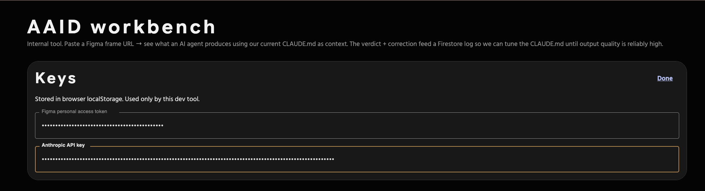
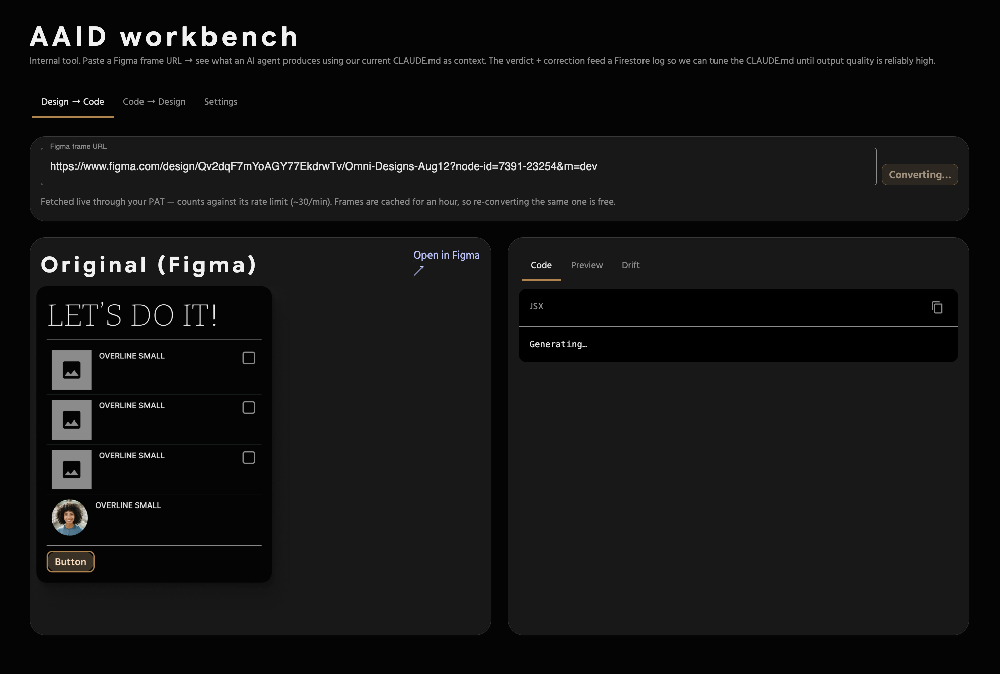
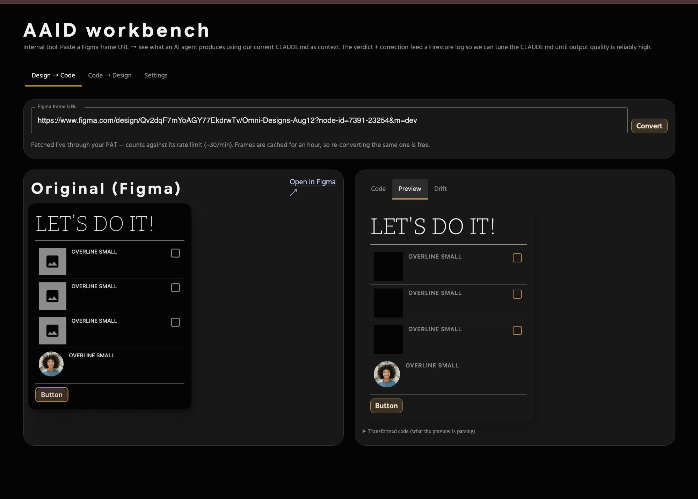
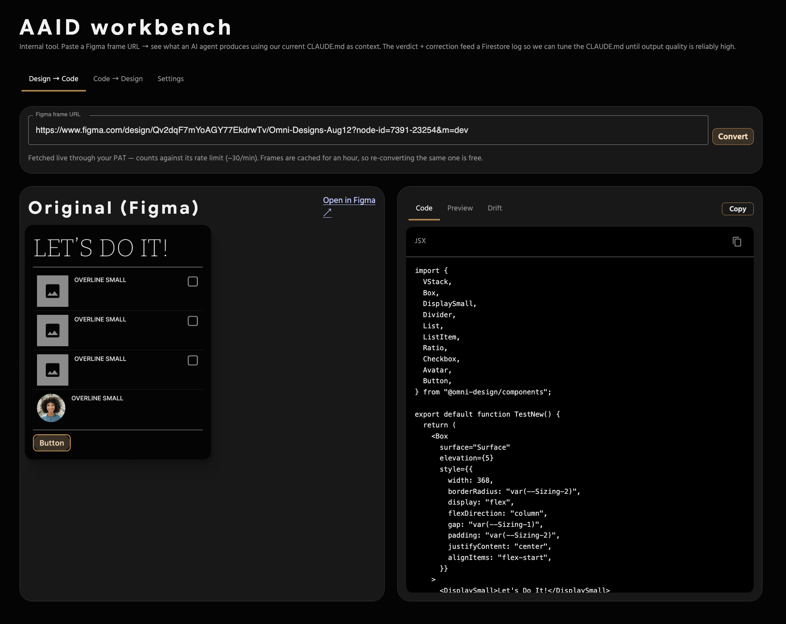
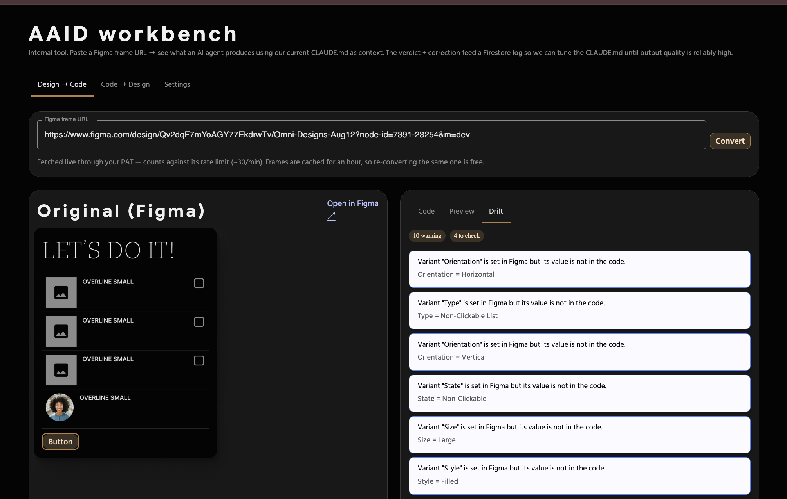

# AAID Workbench — a guide

Paste a Figma frame URL. Get back React code that uses your component library,
a live preview of it, and a list of everything the code does that the design
did not ask for.

It runs at `/admin/aaid-workbench`.

---

## What it is for

Not "generate my app". The workbench is a **tuning loop**. You convert a frame,
look at what came back, and when it gets something wrong you say so — and the
correction feeds the instructions the next conversion runs against.

The output quality is a function of those instructions. This is how you improve
them.

---

## First run: keys

Two credentials, once. They live in your browser's `localStorage` and go
nowhere else — no server, no logging. The tool opens on **Settings** until both
are present and valid.



### Figma personal access token

1. Figma → your avatar (top right) → **Settings**
2. **Security** tab → scroll to **Personal access tokens**
3. **Generate new token**, give it a name
4. Scope: it needs **File content: read**. Read-only is enough — the workbench
   never writes to your files.
5. Copy it immediately. Figma shows it once.

It starts with **`figd_`**. Paste anything else and the field says so.

Direct link: **figma.com/developers/api#access-tokens**

### Anthropic API key

1. **console.anthropic.com** → sign in
2. **Settings → API keys** (console.anthropic.com/settings/keys)
3. **Create Key**, name it something like `aaid-workbench`
4. Copy it immediately. The console shows it once.

It starts with **`sk-ant-`** and is around 100 characters.

Two things worth knowing before you hit a confusing error:

- **The account needs credit.** A valid key on an account with no balance fails
  with *"Your credit balance is too low"* — that is billing, not the key. Add
  credits under **Plans & Billing**.
- **A Team account may not be able to buy credits directly.** Organisations can
  be asked to complete a Trust & Safety questionnaire first. A personal account
  usually can, and that is the faster path to a working key.

### Design ID (optional)

Also in Settings. Paste a design system's UUID and the workbench loads that
brand's tokens — the generated code resolves against that brand's CSS, and the
**workbench itself re-skins to match**, so you are looking at the design system
you are generating for.

Leave it blank to convert against default-theme tokens.

---

## Converting a frame

Copy a frame URL from Figma — select the frame, right-click → **Copy link to
selection**. It looks like:

```
https://www.figma.com/design/<fileKey>/<name>?node-id=7391-23254
```

Paste it and press **Convert**.



The Figma frame renders on the left as a reference image, and the output appears
on the right. A conversion takes a few seconds.

Two practical notes:

- Frames are **cached for an hour**, so re-converting the same one while you
  iterate costs no Figma calls.
- Fetches count against your token's rate limit, roughly **30 per minute**.

---

## Reading the output: Code, Preview, Drift

### Code

The generated JSX, importing from your library.



**Copy** puts it on your clipboard. Read the imports first — they tell you
straight away whether it reached for real components or invented something.

### Preview

The code, rendered live, beside the Figma original.



This is the fastest check you have. Put them side by side and the differences
that matter — wrong spacing, wrong weight, a missing divider — are obvious in a
second, in a way that reading code is not.

Expand **Transformed code** underneath to see exactly what the preview is
parsing, if a render looks wrong and you want to know why.

### Drift

Everything the code does that the frame did not say.



Preview catches drift you can *see*. Drift catches the rest — the differences
that render as something entirely plausible:

| Finding | What it means |
| --- | --- |
| **Hardcoded colour** | A literal `#3794ff` where a token belongs. Renders identically — until someone switches theme. Always wrong. |
| **Hidden in Figma but present in the code** | A layer the designer turned off that got rendered anyway. It just looks like an extra row. |
| **Variant not in the code** | A variant set in Figma with no matching prop, so you get the component's default. *Nearly* right, which is the worst kind of wrong. |
| **Text missing** | Copy in the frame that never made it into the code. |
| **Instance unmapped** | A Figma component instance with no counterpart in the output. |

The count on the tab is **errors only**. Warnings and "to check" are frequently
legitimate — text is often bound to a prop rather than inlined, and a designer's
layer name need not survive into code — so a badge counting those would never be
zero, and a badge that is never zero is a badge nobody reads.

Every check is deterministic. It compares the frame JSON to the emitted code and
reports facts — no second model call, nothing to pay for, and the same input
always gives the same answer.

**Treat findings as signals, not verdicts.** Some are noise. The point is to put
the differences in front of you fast.

---

## Closing the loop

Under the output: 👍 / 👎 and a box for *what was wrong, or what you would have
written instead*.

Be specific. "Wrong component" helps less than "used Box with a border instead
of Card". The corrections accumulate, and they are what the instructions get
tuned against — which is the entire point of the tool.

---

## Code → Design

The second tab goes the other way: paste JSX, and it resolves which library
components it uses and builds a payload for a Figma frame.

One honest limitation. **Figma's REST API cannot create frames** — it is
read-only for document content. Only a Figma *plugin* can write to a file. So
this tab prepares the payload and hands it to the plugin; the plugin does the
building. Until the plugin supports it, the payload is there to copy.

---

## When something goes wrong

| What you see | What it is |
| --- | --- |
| *"Anthropic rejected the API key"* | Usually the **wrong value pasted**, not an expired key — a Design ID in the key box is the common one. Keys start with `sk-ant-`. |
| *"out of credit"* | Billing. Add credits at console.anthropic.com. The key is fine. |
| *"rate limit hit"* | Too many Figma fetches. Wait a minute. |
| *"Could not parse URL"* | The link needs a `node-id`. Use **Copy link to selection** on a frame, not the file URL. |
| Keys look right, still failing | Open **Settings** → the fields flag anything that is not the right shape. |
